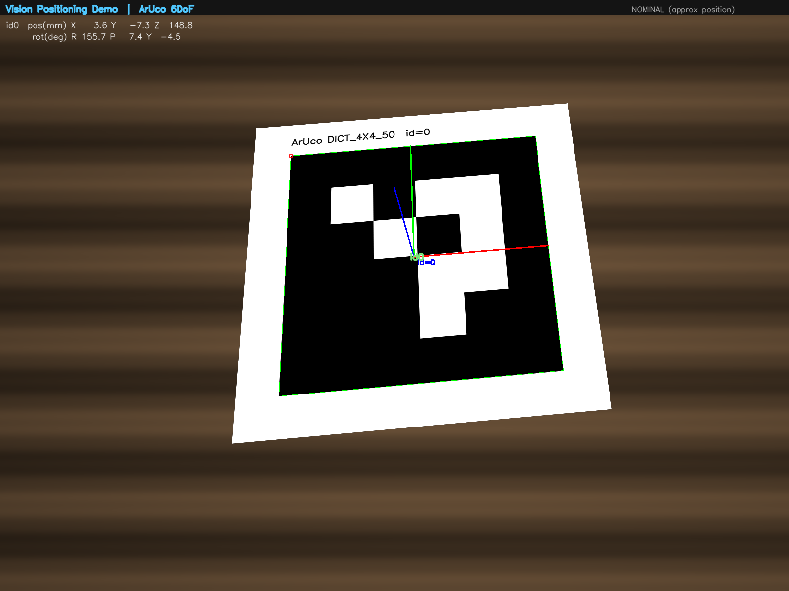

# Vision Positioning Demo — ArUco 6DoF Pose

Real-time **6DoF visual positioning** from a single webcam. Detects an ArUco
fiducial marker, solves its full pose with `cv2.solvePnP`, and outputs a
**position (X/Y/Z in mm) + orientation (roll/pitch/yaw in deg)** stream — the
same kind of "where and at what angle to pick" data a vision-guided robot arm
consumes.

> Built by **Mars** as a focused capability demo for semiconductor equipment
> vision-positioning integration.



*The image above comes from `python demo.py --image ...` run on a synthetic
composite (a generated ArUco marker perspective-warped onto a procedural desk
background — see `samples/make_test_image.py`), not a real camera photo. It
exercises the exact same detection + solvePnP pipeline as the live webcam
mode below; only the input source differs.*

---

## Why this exists / 為什麼做這個

Vision-guided positioning is the core of equipment automation: tell a robot
arm **where** a part is and **how it's oriented** so it can pick, place, or
align it. This demo shows that pipeline end-to-end on commodity hardware:

```
webcam frame ─▶ ArUco detect ─▶ solvePnP (pose) ─▶ 3D axis overlay
                                              └─▶ pick-pose coordinate stream
```

中文：視覺導引定位是設備自動化的核心 —— 告訴機器手臂零件**在哪**、**朝向為何**，
才能精準取放與對位。本 demo 用一般 webcam 完整跑通這條管線：偵測標記 → 解算 6DoF
姿態 → 疊 3D 座標軸 → 輸出可餵給機器手臂的取放座標流。

---

## What it does

- Detects `DICT_4X4_50` ArUco markers in the live webcam feed
- Recovers full **6DoF pose** per marker via `solvePnP` (IPPE_SQUARE)
- Draws the marker's **3D coordinate axes** on the frame
- HUD overlay + console stream of `pos(mm)` and `rot(deg)`:
  ```
  -> POSE id=0 pos=(12.4,-8.1,243.7)mm rot=(-2.1,178.9,0.4)deg
  ```

---

## Quick start

```bash
pip install -r requirements.txt

python generate_marker.py        # -> marker.png  (print it once)
python demo.py                   # point the printed marker at your webcam
```

Controls in `demo.py`: `q` quit · `s` save snapshot.

> Set `MARKER_SIZE_MM` in `demo.py` to the **printed** black-square edge length
> (measure it with a ruler) so the position readout is to scale.

### No webcam or printed marker? Run on a static image

`demo.py --image` runs the exact same detect → solvePnP → draw pipeline on a
single file instead of a live camera feed — useful for a quick check with no
hardware on hand:

```bash
python generate_marker.py                 # -> marker.png
python samples/make_test_image.py         # -> samples/desk_with_marker.png (synthetic)
python demo.py --image samples/desk_with_marker.png --out docs/demo-static.png
```

`samples/desk_with_marker.png` is a synthetic composite, not a camera photo —
see `samples/make_test_image.py` for how it's built. Point `--image` at a real
photo of a printed marker instead to get an actual measurement.

### Optional: metric calibration

`demo.py` runs out-of-the-box with **nominal intrinsics** (focal ≈ frame
width). Orientation and the 3D axis are stable; absolute position is
approximate. For true metric accuracy, calibrate your specific camera once:

```bash
python calibrate.py              # print a 9x6 chessboard, capture >=12 views
# -> camera_params.npz, loaded automatically by demo.py
```

---

## How it works (technical)

1. **Detection** — `cv2.aruco.ArucoDetector` (with legacy-API fallback for
   OpenCV < 4.7) finds marker corners in the grayscale frame.
2. **Pose** — `cv2.solvePnP` with the marker's known 3D corner geometry and
   the camera intrinsics returns a rotation vector `rvec` and translation
   `tvec` (the marker pose in the camera frame).
3. **Readout** — `tvec` is the position in mm; `rvec` is converted to
   roll/pitch/yaw via `cv2.Rodrigues`. `cv2.drawFrameAxes` visualizes it.

This is exactly the fiducial-based method used in real robotics for
**hand-eye calibration** and **fixture/part localization**.

---

## Honest limitations (and the production version)

This is a **concept demo**, deliberately scoped. A production line build differs:

| Demo (this repo) | Production line |
|---|---|
| Webcam, 2D + planar marker | Industrial camera; **RealSense / stereo** for true depth (Z) |
| Printed ArUco fiducial | **Markerless**: trained detector (YOLO/feature/CAD 6DoF) on the actual part |
| Nominal or quick calibration | Full intrinsic **+ hand-eye** calibration against the robot base frame |
| Pose printed to console | Pose published to the **robot/PLC** (e.g. via SECS/GEM, OPC UA, TCP) |

The algorithm and math are the same — production swaps the camera, the
detector model, and the downstream interface.

---

## Stack

Python · OpenCV (`opencv-contrib-python`) · NumPy

## License

MIT

---

## Questions

Open an issue at
[github.com/Lumeon-Labs/vision-positioning-demo/issues](https://github.com/Lumeon-Labs/vision-positioning-demo/issues).
